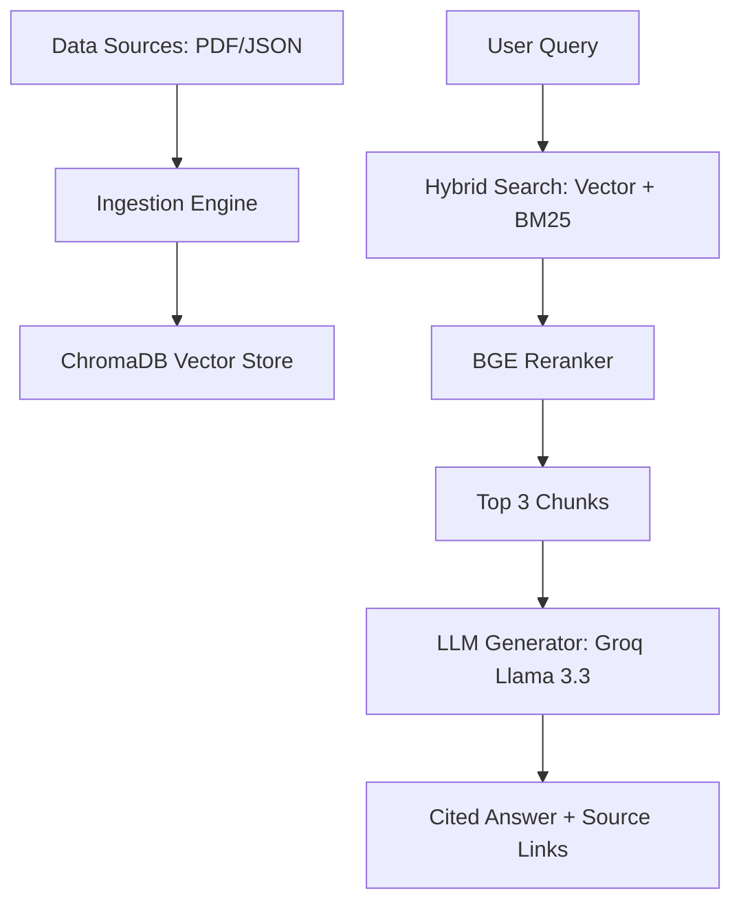

# SchemeScout Architecture

SchemeScout is a high-precision RAG (Retrieval-Augmented Generation) system designed to provide accurate, cited information about Indian Government schemes.

## 1. System Overview
The system follows a modern RAG pipeline consisting of three main phases: Ingestion, Retrieval, and Generation.

## 2. Core Components

### A. Ingestion Engine (`backend/ingestion/`)
- **Parsers**: Custom logic for structured JSON schemes and unstructured PDF guidelines.
- **Chunking**: Recursive character splitting with a chunk size of 1000 and 200 overlap.
- **Embeddings**: `BAAI/bge-small-en-v1.5` (running on CPU). Chosen for its top-tier performance on the MTEB leaderboard.

### B. Retrieval Engine (`backend/retrieval/`)
- **Hybrid Search**: Combines semantic vector search (ChromaDB) with keyword-based search (BM25) to catch both conceptual matches and specific scheme names.
- **Reranker**: `BAAI/bge-reranker-base`. Cross-encoders provide much higher precision than simple cosine similarity by scoring the query against each chunk directly.
- **State Boosting**: If a state name (e.g., "Karnataka") is detected in the query, results matching that state's metadata receive a score boost.

### C. Generation Layer (`backend/generation/`)
- **Model**: `Llama-3.3-70b-versatile` via Groq.
- **Precision Guardrails**:
    - **Citations**: LLM is strictly instructed to only use the provided context.
    - **Fallback**: Graceful error handling if generation fails, providing raw context to the user.
    - **Source Links**: UI filters out broken or "N/A" links.

## 3. Technology Stack
- **Frontend**: React, Vite, Tailwind CSS, Framer Motion (for animations), Lucide React (icons).
- **Backend**: FastAPI, Uvicorn, Pydantic.
- **AI Framework**: LangChain (Retrievers/Loaders), Sentence-Transformers (Reranking).
- **Database**: ChromaDB (Vector Store).

## 4. How to Add New Data
1.  **JSON**: Add new scheme data to `backend/data/raw/schemes/`.
2.  **PDF**: Add official PDF guidelines to `backend/data/raw/pdfs/`.
3.  **Re-index**: Run `python backend/ingestion/embedder.py`.

## 5. Known Limitations
- CPU-based embedding/reranking can take 1-2 seconds per query.
- Currently supports English; future expansion planned for Hindi and regional languages.
